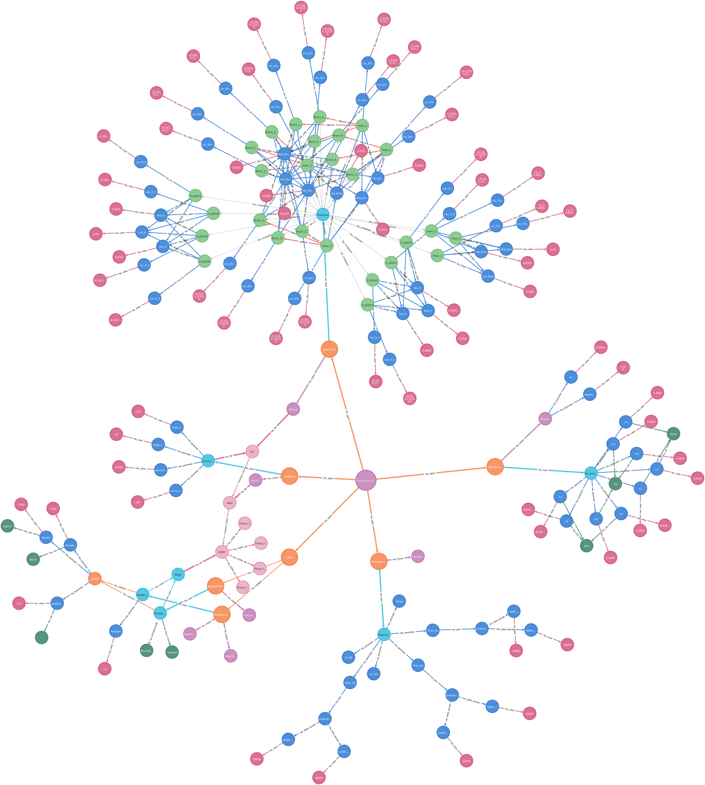
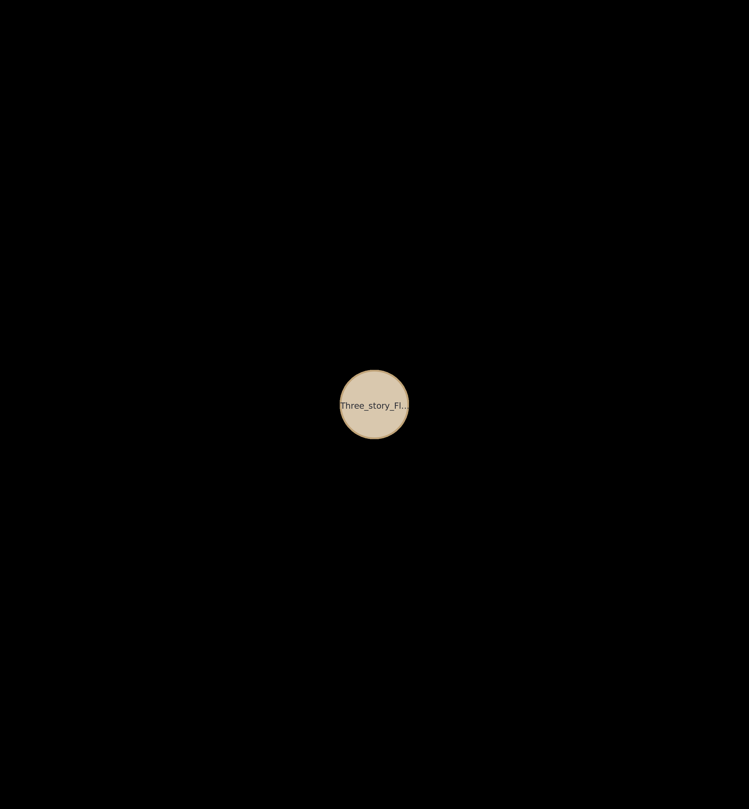

# Knowledge Graphs for digital twins of structural dynamic systems

Release of Multi-agent Digital Twin
[Watch the video](https://github.com/Digital-Twin-Operational-Platform/KG/blob/main/DT_demo_v0.mp4)
<video width="600" controls>
  <source src="https://www.youtube.com/watch?v=8Wpw60e8mMI&ab_channel=XiaoxueShen" type="video/mp4">
</video>

A knowledge graph powered digital twin of structural dynamic systems. This consists of several components: mathmatical modelling (ODE), geometric modelling (python scripts for Blender), meshing (Gmsh), Finite Element Analysis (FEniCSx), and Bayesian inference of model parameters. The knowledge graph is built using Neo4j. These serve as "agents" and are containerised in Docker.

## Deployment Instruction
- Before running the project, make sure both the Docker and Docker Compose have been installed.

https://www.digitalocean.com/community/tutorials/how-to-install-and-use-docker-compose-on-ubuntu-20-04

- To run the DTOP system, first create a virtual environment in the main folder

For linux:
```bash
python3 -m venv env
```
- Then enter the environment

For linux:
```bash
source env/bin/activate
```
- Make sure you have Docker and Docker compose

- Run docker compose
```bash
sudo chmod 777 /var/run/docker.sock
docker compose build
docker compose up
```
- For testing the query functionality, put your OpenAI key to the file at digitaltwin/openai.txt (currently it is empty). You can find your OpenAI API key at https://platform.openai.com/api-keys

- Then, in a web browser, go to http://localhost:7475/ (NOT 7474) to access the knowledge graph. Choose the Connect URL "neo4j://" and change "localhost:7687" to "localhost:7688".
Username: neo4j
Password: 12345678





- Query results


Ask a question about the three-story floor structure (or type 'exit' to quit):

1) How many agents in this graph?

> Entering new GraphCypherQAChain chain...
Generated Cypher:
MATCH (a:agent)
RETURN COUNT(a) as num_agents;
Full Context:
[{'num_agents': 7}]

> Finished chain.
Response: There are 7 agents in this graph.

Ask a question about the three-story floor structure (or type 'exit' to quit):

2) Show me all the agents with their names

> Entering new GraphCypherQAChain chain...
Generated Cypher:
MATCH (a:agent)
RETURN a.agent_name;
Full Context:
[{'a.agent_name': 'ODE_MassSpringDamper'}, {'a.agent_name': 'Geometric'}, {'a.agent_name': 'Meshing'}, {'a.agent_name': 'FEM'}, {'a.agent_name': 'ModalAnalysis'}, {'a.agent_name': 'SteadyState'}, {'a.agent_name': 'Bayesian_UQ'}]

> Finished chain.
Response: ODE_MassSpringDamper, Geometric, Meshing, FEM, ModalAnalysis, SteadyState, Bayesian_UQ


Ask a question about the three-story floor structure (or type 'exit' to quit):

3) Show me the parameters of material al6082, and show their values and units

> Entering new GraphCypherQAChain chain...
Generated Cypher:
MATCH (m:material {material_name: 'al6082'})-[:has_parameter]->(p:parameter)
MATCH (p)-[:has_value]->(v:parameter_value)
MATCH (p)-[:has_unit]->(u:parameter_unit)
RETURN p.parameter_name, v.parameter_value, u.parameter_unit
Full Context:
[{'p.parameter_name': 'possionsratio', 'v.parameter_value': '0.3', 'u.parameter_unit': '-'}, {'p.parameter_name': 'youngsmodulus', 'v.parameter_value': '70e9', 'u.parameter_unit': 'N/m2'}, {'p.parameter_name': 'density', 'v.parameter_value': '2700', 'u.parameter_unit': 'kg/m3'}]

> Finished chain.
Response: The parameters of material al6082 are as follows:
- Poisson's Ratio: 0.3 (-)
- Young's Modulus: 70e9 N/m2
- Density: 2700 kg/m3